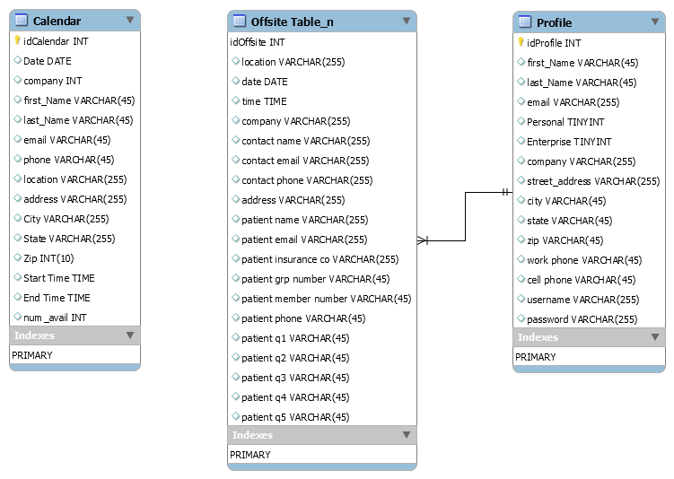

This project was bootstrapped with [Create React App](https://github.com/facebook/create-react-app).

## Application WorkFlow

The entry point for this application is a splash landing page that will provide basic content and collateral and allow the visitor to take 2 actions: `Create Profile` & `Login`

## There will be 2 types of profiles: `Personal` & `Enterprise`
  ### Both profile types will allow the user to enter basic informatio(name, address, email).
  
  ### The Enterprise profile type upon logging in will see a `Create Offsite Event` application that allows the user to pick a date,        start & end time, company name & location and preferred contact. 
  
## 3 pages: 
### Splash/Landing
### Create Profile
### Profile Page

## Database Design & Testing

To facilitate calendar creation, profile rendering and offsite scheduling the basic design.
Using `faker(https://www.npmjs.com/package/faker)`, `sequelize(https://sequelize.org/v5/)`, `sequelize-auto(https://www.npmjs.com/package/sequelize-auto)` &  `mysql2(https://www.npmjs.com/package/mysql2)`

